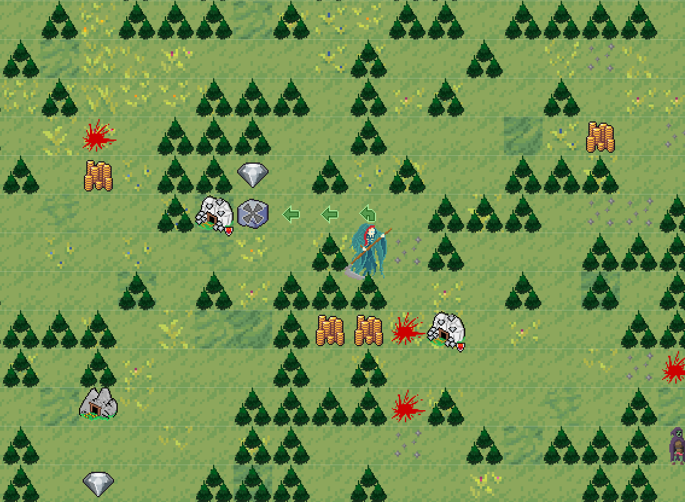
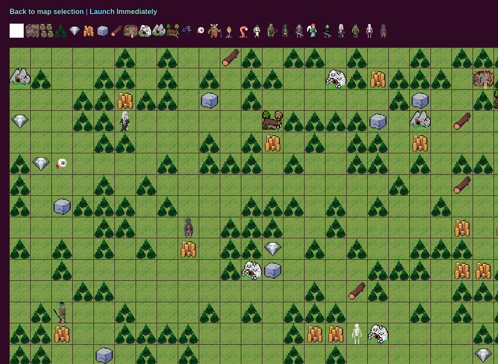
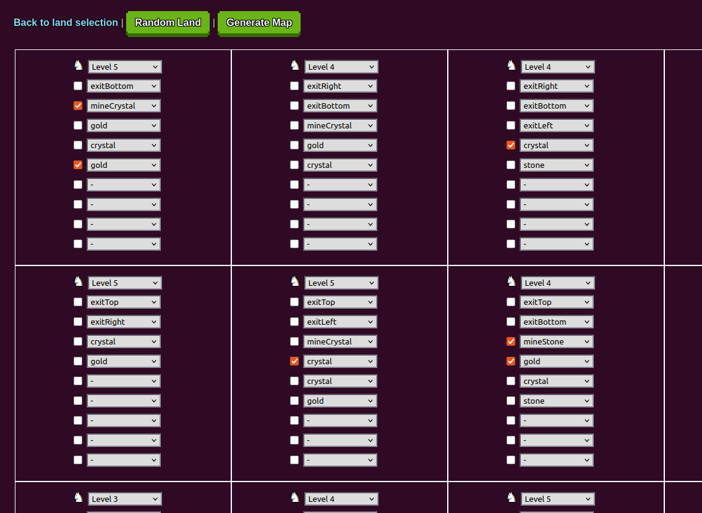
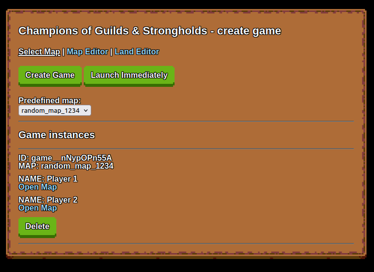

# Champions of Guilds and Strongholds

## Gameplay


Champions of Guilds and Strongholds is a multiplayer strategy game set in a fantasy world of castles, heroes, and rival factions. Players explore a shared map, expand their power from their castles, and clash in tactical battles where unit skills and positioning decide the outcome.

## Game Context
You lead a faction of heroes and units across a procedurally built land. Each game starts with a generated map and land layout, then players choose their race, prepare their forces, and enter the world together. The goal is to grow your economy, control key locations, and defeat rival heroes.



## Features
- Multiplayer fantasy strategy with simultaneous turns (all players act at the same time, then the turn resolves together).
- Procedural map generator and land generator for varied playthroughs.
- Castle management: build race-specific buildings and unlock stronger units.
- Unit recruitment system with resource costs and tiered progression.
- World exploration with fog, resources, and strategic positions.
- Capturable mines that generate ongoing income.
- NPC encounters and PvP hero battles.
- Save/load snapshots of turns for quick rollback and replay.





## Core Gameplay Loop
1. Pick your race and name in the lobby.
2. Prepare your castle and initial hero.
3. Explore the map, gather resources, and capture mines.
4. Recruit units and build fortifications to expand your army.
5. Engage in battles against NPC stacks or other players.
6. End the turn when ready and wait for other players to finish.

## Economy and Resources
Resources are collected directly from the map and from captured mines. Each day (turn) provides baseline income, and mines add ongoing resource generation. This fuels building construction and unit recruitment.

## Battles
Battles take place on a grid-based battlefield with unit stacks. Each stack has its own stats (life, movement, maneuvers, damage) and can perform actions like walking, melee attacks, shooting, or waiting. Damage is calculated using multiple parameters:
- Unit base damage and unit count.
- Line-of-fire obstacles for ranged attacks.
- Randomized damage grades (miss, low, mid, high, crit).
- Target life/stack size and remaining unit health.

When a player fights against NPC forces, another human player controls the NPC units, turning the encounter into a PvP-style tactical duel.


## Tech Stack
- Node.js + Express backend
- MongoDB persistence
- Pixi.js rendering on the client

## Local Setup
Requirements:
- Node.js (v14+ recommended)
- npm (comes with Node.js)
- MongoDB running locally on `mongodb://localhost:27017`

Install and run:
```bash
npm install
npm start
```

Open the admin panel at:
- `http://localhost:3000/panelAdmin`

From there you can create a game, launch it, and open player links.

## Roadmap Ideas
- Additional races and unit archetypes
- New castles and more buildings in castles
- Improved fog of war
- Better animations during hero movement and in battles
- Better UI
- More map generators and land presets
- Expanded battle abilities and terrain effects
